# Project #1 - SQL & Excel - Capital Bikeshare

# Question: How many trips were there in each month of each year?

## Query:

```sql
WITH MONTH_WISE_TRIPS AS (

SELECT DATE_PART('YEAR', START_TIME) AS YEAR, DATE_PART('MONTH', START_TIME) AS MONTH, 
			 COUNT(*) AS NUM_TRIPS
FROM CAPITALBIKESHARE_2019
GROUP BY 1, 2

UNION ALL

SELECT DATE_PART('YEAR', START_TIME) AS YEAR, DATE_PART('MONTH', START_TIME) AS MONTH, 
			 COUNT(*) AS NUM_TRIPS
FROM CAPITALBIKESHARE_2018
GROUP BY 1, 2

UNION ALL

SELECT DATE_PART('YEAR', START_TIME) AS YEAR, DATE_PART('MONTH', START_TIME) AS MONTH, 
			 COUNT(*) AS NUM_TRIPS
FROM CAPITALBIKESHARE_2017
GROUP BY 1, 2

UNION ALL

SELECT DATE_PART('YEAR', START_TIME) AS YEAR, DATE_PART('MONTH', START_TIME) AS MONTH, 
			 COUNT(*) AS NUM_TRIPS
FROM CAPITALBIKESHARE_2016
GROUP BY 1, 2
)

SELECT * FROM MONTH_WISE_TRIPS
ORDER BY 1, 2
```

## Process Steps:

The result from the aforementioned query was captured in the tab month_wise_trips in the main project excel workbook.

## Visualization:

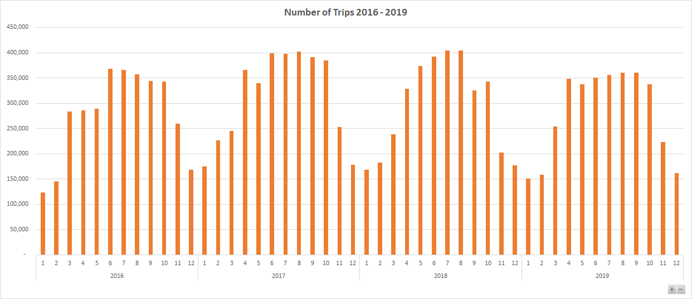

## Analysis Conclusion:

- We see a clear a seasonal trend, where we see demand start to pick up from Feb / Mar each year and start to tapper off Oct / Nov.
- Dec & Jan seems to have the least demand, most likely due to the holiday season and also due to inclement weather.
- April – Oct, each year see the major demand with an average of **360K** trips per year.

# Which stations are showing the greatest growth rates?

## Query:

```sql
WITH STATION_CTE AS (

SELECT DATE_PART('YEAR', START_TIME) AS YEAR, START_STATION_ID AS STATION_ID, COUNT(*) AS NUM_TRIPS
FROM CAPITALBIKESHARE_2019
GROUP BY 1, 2 

UNION ALL

SELECT DATE_PART('YEAR', START_TIME) AS YEAR, START_STATION_ID AS STATION_ID, COUNT(*) AS NUM_TRIPS
FROM CAPITALBIKESHARE_2018
GROUP BY 1, 2 
) 

SELECT YEAR, STATION_ID, NAME AS STATION_NAME, NUM_TRIPS  
FROM STATION_CTE LEFT JOIN CAPITALBIKESHARE_STATIONS 
								 ON STATION_CTE.STATION_ID = CAPITALBIKESHARE_STATIONS.ID
WHERE NAME IS NOT NULL
ORDER BY 2,1
```

## Process Steps:

- The result from the aforementioned query was captured in the tab stations_growth in the main project excel workbook.
- I then created a pivot table from the extracted data sorted the data first with the most increase in difference between 2018 and 2019 numbers, followed by sorting the data with the most decrease in difference between 2018 and 2019 numbers.

## Visualization

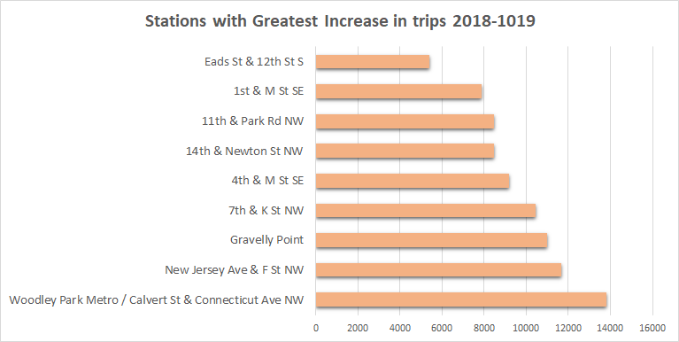

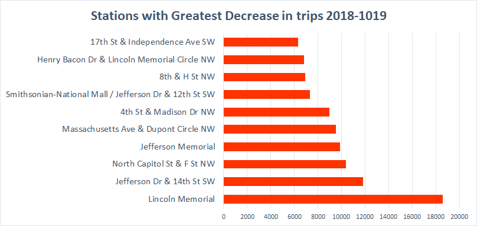

## Analysis Conclusion:

***Stations with highest decrease in number of trips. 2018 - 2019***

1. **Lincoln Memorial** - From: 53,869 To: 35,268; Decline: **-18,601**
2. **Jefferson Dr & 14th St SW** - From: 43,993 To: 32,180; Decline: **-11,813**
3. **North Capitol St & F St NW** - From: 26,522 To: 16,173; Decline: **-10,349**
4. **Jefferson Memorial** - From: 35,752 To: 25,901; Decline: **-9,851**
5. **Massachusetts Ave & Dupont Circle NW** - From: 38,859 To: 29,356; Decline: **-9,503**

*The top 2 Lincoln and Jefferson are in close proximity to each other, so may be it will be better to merge the two stations. Same principal can be applied to rest of the stations showing significant decline.* 

***Stations with highest increase in number of trips. 2018 - 2019***

1. **Woodley Park Metro / Calvert St & Connecticut Ave NW** - From: 240 To: 14038; Growth: **13798**
2. **New Jersey Ave & F St NW** - FROM: 235 TO: 11896; Growth: **11661**
3. **Gravelly Point** - From: 432 TO: 11440; Growth: **11008**
4. **7th & K St NW** - From: 1294 TO: 11756; Growth: **10462**
5. **4th & M St SE** - From: 435 TO: 9604; Growth: **9169**

*Most of these seem to be new stations developed somewhere in 2018, hence the growth. However, of particular attention is Gravelly Point which was there in 2017, as well, so the numbers at this station has shown some real growth.* 

# Question: Is there a difference in growth between holiday activity and commuting activity?

## Query:

```sql
SELECT DATE(START_TIME), COUNT(*) FROM PUBLIC.CAPITALBIKESHARE_2019
GROUP BY 1

UNION

SELECT DATE(START_TIME), COUNT(*) FROM PUBLIC.CAPITALBIKESHARE_2018
GROUP BY 1
```

## Process Steps:

1. The result from the aforementioned query was captured in the tab Holidays vs NonHolidays in the main project excel workbook. 
2. After extracting this data, I compared the days against the mentioned holidays for Washington DC and added a column whether the date is a holiday (including weekend) or a regular weekday. 
3. And finally I created the pivot table breaking down the data into years and labelled categories of Holidays, to compare the numbers of trips during Holidays and regular days for 2018 and 2019.

## Visualization

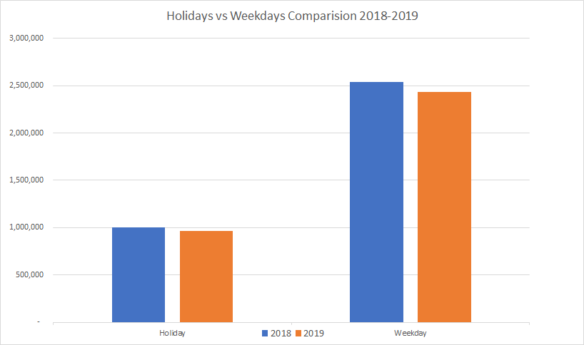

## **Analysis:**

There is no marked difference in the holidays and regular workdays activity during the two years (2018 and 2019) *with both Holidays and regular workdays activity showing a small decline in activity during from 2018 to 2019*.

# Question: What was the longest journey? What do we know about it?

## Query

```sql
SELECT bike_id, user_type, 
			 start_time, start_station_id, start_station_name, start_latitude, start_longitude, 
			 end_time, end_station_id, end_station_name, end_latitude, end_longitude, 
			 calculate_distance(start_latitude, start_longitude, 
													end_latitude, end_longitude,'K') as trip_distance

FROM 	
			(SELECT	ROW_NUMBER() OVER(), bike_id, user_type, 
			 start_time, start_station_id, name as start_station_name, latitude as start_latitude, 
			 longitude as start_longitude 
			 FROM capitalbikeshare_2019 LEFT JOIN capitalbikeshare_stations ON start_station_id = id) 
			 AS start_table

JOIN 

			(SELECT ROW_NUMBER() OVER(), 
			 end_time, end_station_id, name as end_station_name, latitude as end_latitude, 
			 longitude as end_longitude
			 FROM capitalbikeshare_2019 LEFT JOIN capitalbikeshare_stations ON end_station_id = id) 
			 AS end_table

USING (row_number)

WHERE  start_station_id IS NOT NULL AND start_latitude IS NOT NULL AND start_longitude IS NOT NULL
			 AND end_station_id IS NOT NULL AND end_latitude IS NOT NULL AND end_longitude IS NOT NULL

ORDER BY 13 DESC
LIMIT 1
```

## Process Steps:

The result from the aforementioned query was captured in the tab trips_distances in the main project excel workbook. 

## **Answer:**

Details about longest journey.  

**bike_id:**	                 W24181
**user_type:**	         Casual
**start_time:**	         11/08/2019 8:33:55 AM
**start_station_id:**	 32018
**start_station_name**	: Needwood Rd & Eagles Head Ct
**start_latitude:**	          39.123513
**start_longitude:**	  77.15741
**end_time:**                  11/08/2019 1:51:48 PM
**end_station_id:**          32406
**end_station_name:**	   Fleet St & Waterfront St
**end_latitude:**              38.782633
**end_longitude:**           77.016059
**trip_distance (Km):**     39.8242155277513

*Since the average trip distance is 1.78km, this journey is almost 20X times the average distance.  Further the distance between the two stations is approx 35 miles.* 

# How often do bikes need to be relocated?

## Query:

```sql
WITH outer_cte as (

WITH inner_cte as (
SELECT 	bike_id,
	end_time, end_station_id, 
	start_time, start_station_id 
FROM capitalbikeshare_2019
GROUP BY 1, 2, 3, 4, 5
ORDER BY 1, 2, 3, 4, 5
)

SELECT 	bike_id, end_time, end_station_id,
				LEAD(start_time,1) OVER(PARTITION BY bike_id) AS next_start_time,
				LEAD(start_station_id,1) OVER(PARTITION BY bike_id) as next_start_station_id
FROM inner_cte)

SELECT * FROM outer_cte WHERE end_station_id <> next_start_station_id
```

## Process Steps:

- The result from the aforementioned query was captured in the tab bike_relocation_data in the main project excel workbook.
- After extracting this data, I ran a simple pivot table to summarize the data into month wise.
- Further, digging a bit deeper, I wanted to look at the stations which required the most relocations and have captured that information below.

## Visualization

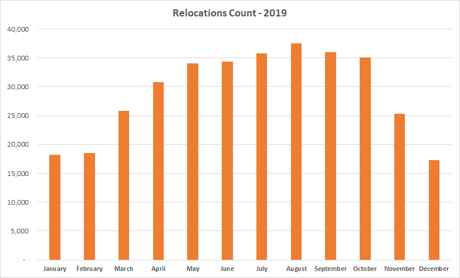

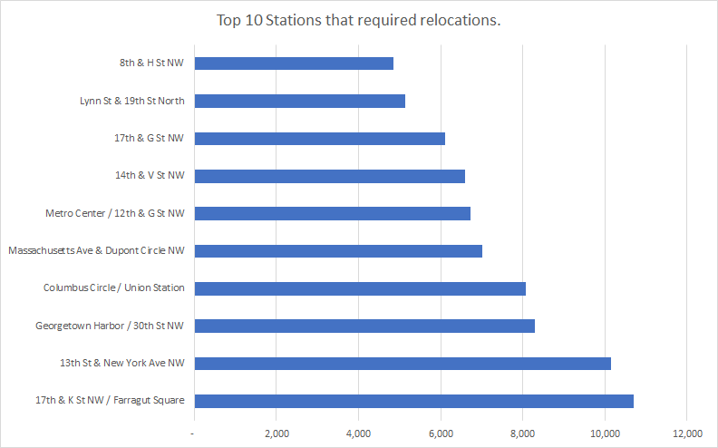

## Analysis:

- The overall average in 2019 was 29K.
- However, If we remove the low demand months of Dec, Jan and Feb, we see on average around 32000 relocations in 2019.
- Below are the top 20 locations that required relocations, so we need to dig deeper into root cause of these relocations and if they are due to having limited dock stations, then may be we need to add some more dock stations at these locations.
- A good measure to look at these locations would be the ratio of trips to these stations vs dock space and below is a summary of top 15 stations that had the most relocations along with trips per docks information.

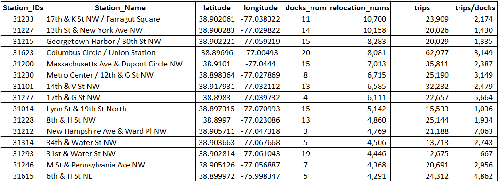

- The average docks for these stations is `11` and average trips per docks number was `2,869` for these stations. Now lets compare this against the stations that had the least relocations.

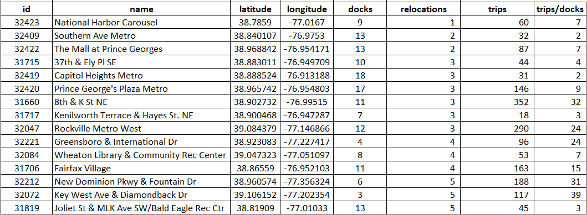

- The average docks for these stations is `11` as well but the average trips per docks number was just `14` for these stations.

*So we clearly see two extremes here but we can easily make a conclusion that the stations that had the most relocations, don't have enough docks compared to the demands at those stations. Comparing the aforementioned information to overall numbers in 2019, we see that, the average number of trips per station is `5850`. And average docks per station is `9`. So average trips per average docs gives us a number of **650 trips** per dock. And clearly the stations performing worst have atleast `4 times` less then the required docks.* 

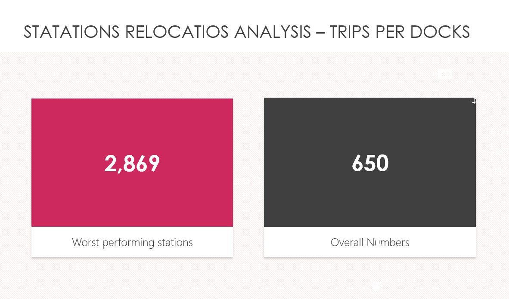

# How far is a typical journey?

## Query

```sql
WITH cte as (

SELECT bike_id, user_type, 
			 start_time, start_station_id, start_station_name, start_latitude, start_longitude, 
			 end_time, end_station_id, end_station_name, end_latitude, end_longitude, 
			 calculate_distance(start_latitude, start_longitude, 
													end_latitude, end_longitude,'K') as trip_distance

FROM 	
			(SELECT	ROW_NUMBER() OVER(), bike_id, user_type, 
			 start_time, start_station_id, name as start_station_name, latitude as start_latitude, 
			 longitude as start_longitude 
			 FROM capitalbikeshare_2019 LEFT JOIN capitalbikeshare_stations ON start_station_id = id) 
			 AS start_table

JOIN 

			(SELECT ROW_NUMBER() OVER(), 
			 end_time, end_station_id, name as end_station_name, latitude as end_latitude, 
			 longitude as end_longitude
			 FROM capitalbikeshare_2019 LEFT JOIN capitalbikeshare_stations ON end_station_id = id) 
			 AS end_table

USING (row_number)

WHERE  start_station_id IS NOT NULL AND start_latitude IS NOT NULL AND start_longitude IS NOT NULL
			 AND end_station_id IS NOT NULL AND end_latitude IS NOT NULL AND end_longitude IS NOT NULL
)

SELECT  user_type, to_char(start_time, 'IYYY-IW')  
		CASE 
			WHEN extract(dow from start_time) = 0 THEN 'Sunday'
			WHEN extract(dow from start_time) = 1 THEN 'Monday'
			WHEN extract(dow from start_time) = 2 THEN 'Tuesday'
			WHEN extract(dow from start_time) = 3 THEN 'Wednesday'
			WHEN extract(dow from start_time) = 4 THEN 'Thursday'
			WHEN extract(dow from start_time) = 5 THEN 'Friday'
			ELSE 'Saturday'
		END AS day_of_week, AVG(trip_distance) 
FROM cte
GROUP BY 1, 2
```

## Visualizations and Answer

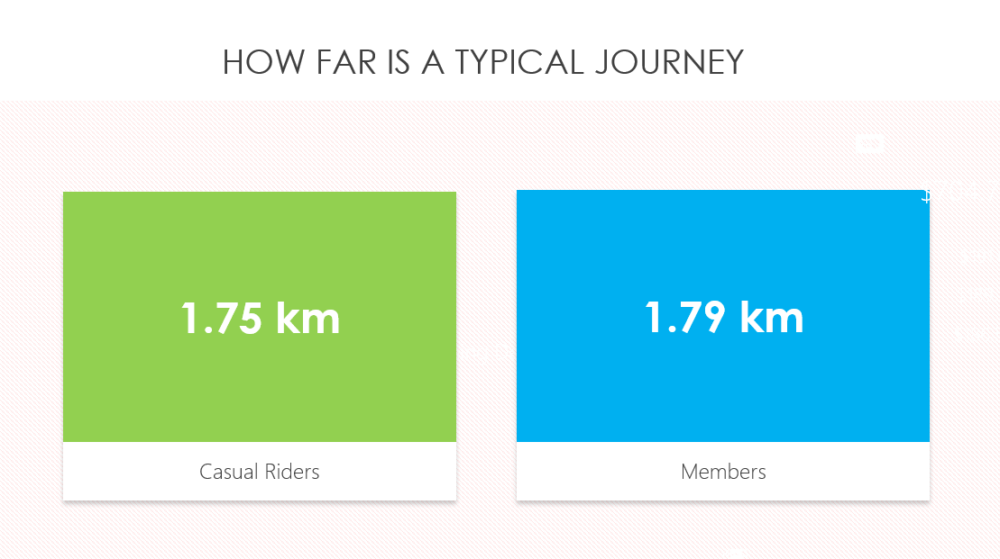

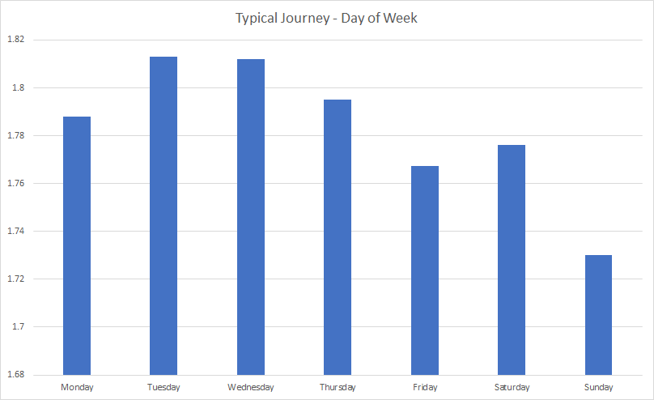

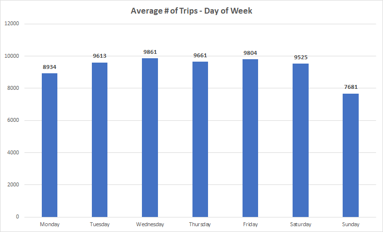

# How effective are subscription systems?

## Query

```sql
SELECT user_type, DATE_PART('year', start_time), DATE_PART('month', start_time), COUNT(*) AS num_trips 
FROM public.capitalbikeshare_2019 
GROUP BY 1, 2, 3

UNION ALL
 
SELECT user_type, DATE_PART('year', start_time), DATE_PART('month', start_time), COUNT(*) AS num_trips 
FROM public.capitalbikeshare_2018 
GROUP BY 1, 2, 3

UNION ALL 

SELECT user_type, DATE_PART('year', start_time), DATE_PART('month', start_time), COUNT(*) AS num_trips 
FROM public.capitalbikeshare_2017 
GROUP BY 1, 2, 3
```

## Process Steps

- The data from the above was captured in the tab subscription_trips.
- After fetching the data, I created the summary pivot table showing, calender year and months vs trips undertaken by casual riders and members, as a proxy for evaluating subscription trends, (as we dont have any data direct on the memberships details).

## Visualization

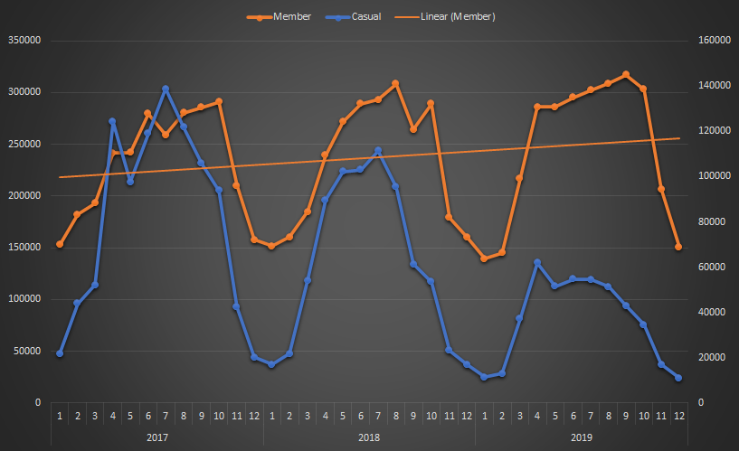

## Analysis

We see a slight upward trend line, which would suggest that the subscription systems are working somewhat. More analysis however, will have to be performed in terms of comparing the trend with the trend from other cities etc.. to make a more definitive answer on subscription service.
